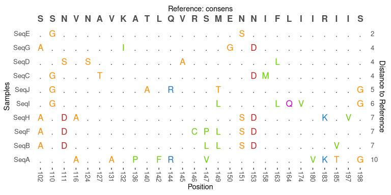

## Overview

SequenceTools is a package for processing and analysing biological
sequence alignments, with a focus is on protein.

## Installation

``` r
# Currently the only way to install it is over github
install.packages("devtools")
devtools::install_github("ltschmitt/SequenceTools")
```

## Usage

You can read in fasta files of DNA or amino acid single letter using
*read_alignments*. The output is a named character vector, which makes
further processing uncomplicated. An example how to read in a fasta
file, generate a consensus sequence and to plot the alignment of all the
reads.

``` r
library(SequenceTools, verbose = F)
library(tidyverse)

# read in single line fasta
seqs = read_alignments(input = 'data_raw/cre-variants.fa', naming = 'headers')
#> reading 1 sequence file(s)...

# make consensus sequence, sequences need to be same length and the consensus is made with the sequences of the same name
consens = generate_consensus(setNames(seqs, rep('consens',length(seqs))))

# plot alignment with consens as reference, makes ggplot element
plot_alignment(Alignment = seqs, Reference = consens, seqrange = 100:200) + theme(legend.position = 'none')
```

<!-- -->

``` r
# convert the sequences to a "long" format which makes working with tidyverse tools very easy
seqs = read_alignments(input = 'data_raw/cre-variants.fa', naming = 'filenames')
#> reading 1 sequence file(s)...
lseqs = alignments2long(seqs, get_frequencies = T) 
head(lseqs)
#> # A tibble: 6 × 5
#>   Sample         Pos AA        n  Freq
#>   <fct>        <int> <chr> <int> <dbl>
#> 1 cre-variants     1 M        10   1  
#> 2 cre-variants     2 A         1   0.1
#> 3 cre-variants     2 S         6   0.6
#> 4 cre-variants     2 T         3   0.3
#> 5 cre-variants     3 D         5   0.5
#> 6 cre-variants     3 N         5   0.5

lseqs %>% 
    filter(Pos %in% 100:150) %>% 
    ggplot(aes(x = Pos, y = Freq, fill = AA, label = AA)) + 
    geom_col() + 
    geom_text(position = 'stack', vjust = 1.2) +
    scale_fill_viridis_d('E') +
    theme(legend.position = 'none')
```

<!-- -->

## Functions

-   aa_properties: converts single letter amino acid sequences into the
    requested property
-   alignment_heatmap: makes a heatmap of an alignment with colors
    indicating amino acids.
-   alignment_tsne: makes a tsne dimensionality reduction of an
    alignment
-   alignments2long: converts the alignment into a long format with
    sequence position and single AA/DNA letters.
-   between_lib_distances: plots the all-vs-all hamming distances
    between two libraries
-   color_switcher: takes a color pallette and mixes the color order
-   generate_consensus: generates the consensus sequences of an
    alignment
-   gg_color_hue: emulates the standard ggplot color pallette
-   hamming_heatmap: makes a heatmap of an alignment according to
    all-vs-all hamming distances
-   plot_alignment: plots an alignment
-   plot_frequencies: plots the frequences of the amino acids in the
    library
-   read_alignments: read in alignments as named character vector
-   reverse_complement: converts DNA sequence into the reverse
    complement, works with IUPAC bases
-   within_lib_distances: plots the all-vs-all hamming distances within
    the libraries
-   write_fasta: write sequences into a fasta file format

## Issues

Since this package was developed for my own use, it might contain minor
issues and is not fully developed/consistent. Feel free to let me know,
but I don’t guarantee that I will do something about it.

## Alternatives

This package was developed to suite my preferences, your might want
something different. Here are some other R packages I found to be useful
with similar functions:

[bioseq](https://github.com/fkeck/bioseq)
[ggmsa](https://github.com/YuLab-SMU/ggmsa)
